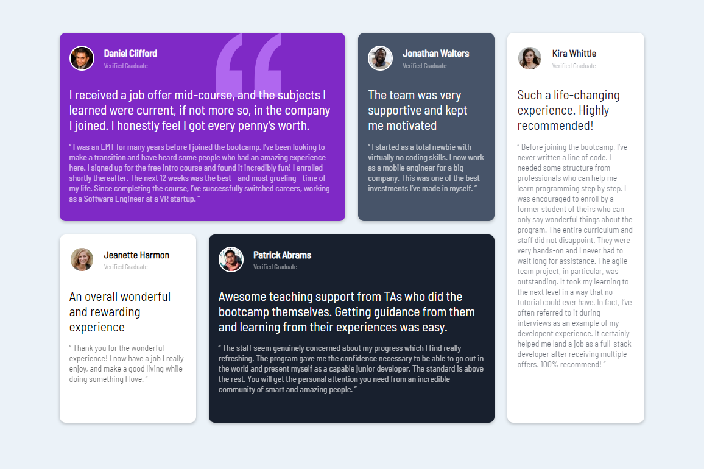

# Frontend Mentor - Testimonials grid section solution

This is a solution to the [Testimonials grid section challenge on Frontend Mentor](https://www.frontendmentor.io/challenges/testimonials-grid-section-Nnw6J7Un7). Frontend Mentor challenges help you improve your coding skills by building realistic projects. 

## Table of contents

- [Overview](#overview)
  - [The challenge](#the-challenge)
  - [Screenshot](#screenshot)
  - [Links](#links)
- [My process](#my-process)
  - [Built with](#built-with)
  - [What I learned](#what-i-learned)
  - [Continued development](#continued-development)
  - [Useful resources](#useful-resources)
- [Author](#author)
- [Acknowledgments](#acknowledgments)

## Overview

### The challenge

Users should be able to:

- View the optimal layout for the site depending on their device's screen size

### Screenshot

### Links

- Solution URL: [Git Repositiry](https://github.com/Robert-Thaiyah/testimonials-grid-section)
- Live Site URL: [Add live site URL here](https://your-live-site-url.com)

## My process

### Built with

- Semantic HTML5 markup
- CSS custom properties
- Flexbox
- CSS Grid

### What I learned

- Grid Area function

### Continued development

- To avoid using fixed sizes as they mess up the mobile view
- Learn more about grid areas and how to implement them effectively
- Learn more about CSS queries.

### Useful resources

- [5 simple tips to making responsive layouts the easy way](https://www.youtube.com/watch?v=VQraviuwbzU) - I have a eally bad habit of using fixed values when it comes to css. Thanks to this tutorial, I have learnt not to use fixed values but to use min-max values for responsiveness. 
- [Learn CSS Grid the easy way](https://www.youtube.com/watch?v=rg7Fvvl3taU&t=1350s) - This tutorial helped me understand CSS grids the easy way. 
- [CSS Grid Cheatsheet](https://grid.malven.co/) - A website that has the CSS cheatsheet for grids.

## Author

- Website - [Robert Thaiyah](https://github.com/Robert-Thaiyah)

## Acknowledgments
